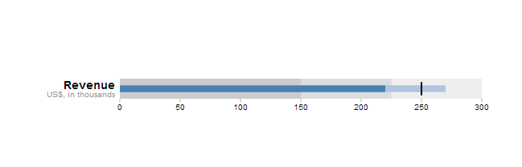
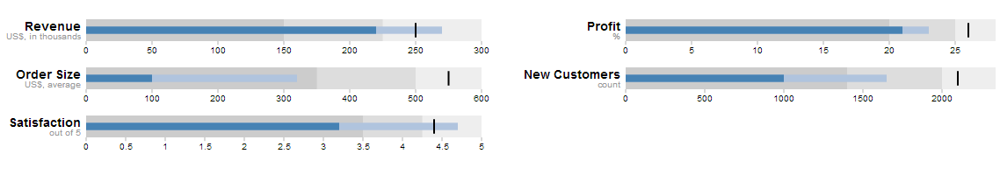

Polymer BulletGraph
=========

A BulletGraph Web Component implemented using [Polymer].  Based on [D3js BulletGraph] implementation.  The d3 dependency has been removed.  Eventually, as I grow more and more comfortable with Polymer, I'll decide if I want to make a version using d3.

TODO:
-----------
  - ~~Remove [d3js] dependency (or take better advantage of it)~~
  - Improve animations, especailly on partial data update
  - Converge onto a single 'style'
  - Find/fix other problems

Individual Bullet
----
> An individual bullet graph, component piece of larger bullet graph.

BulletGraph
----
> Bullet Graph takes data for multiple bullets, and displays appropriate graphs.

## Notes
- I use multiple styles.  For bullet- I have the css/js/html all split out into there own files.  To me this feels more natural, though admittedly, I should probably use a more meaningful folder structure.  For bullet-graph all markup/code is in a single file, most example code looks more like this.  I'm not 100% sure if this is because it tends to be small, or by design.
- Removed d3 dependency.

[D3js BulletGraph]:http://bl.ocks.org/mbostock/4061961
[d3js]:http://d3js.org
[Polymer]:http://www.polymer-project.org

